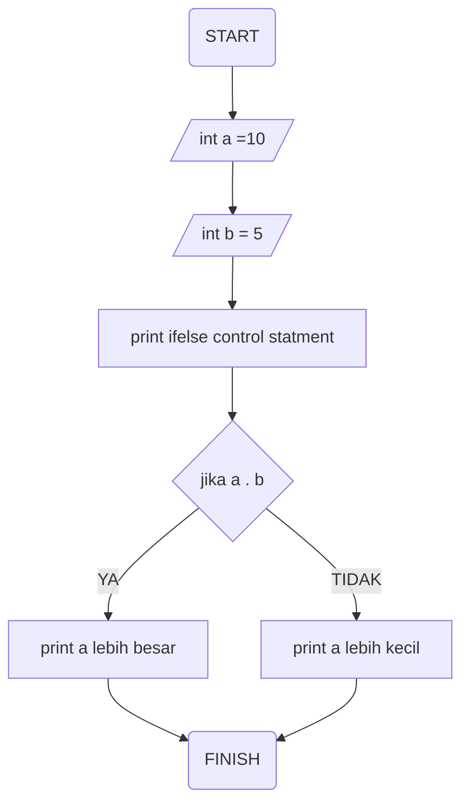

```mermaid
    flowchart TD;
    A(START) --> B[/int a =10/];
    B --> C[/int b = 5/];;
    C --> D[print ifelse control statment];
    D --> E{jika a . b};
    E --YA--> F[print a lebih besar];
    E --TIDAK--> G[print a lebih kecil];
    F --> H(FINISH);
    G --> H;

```